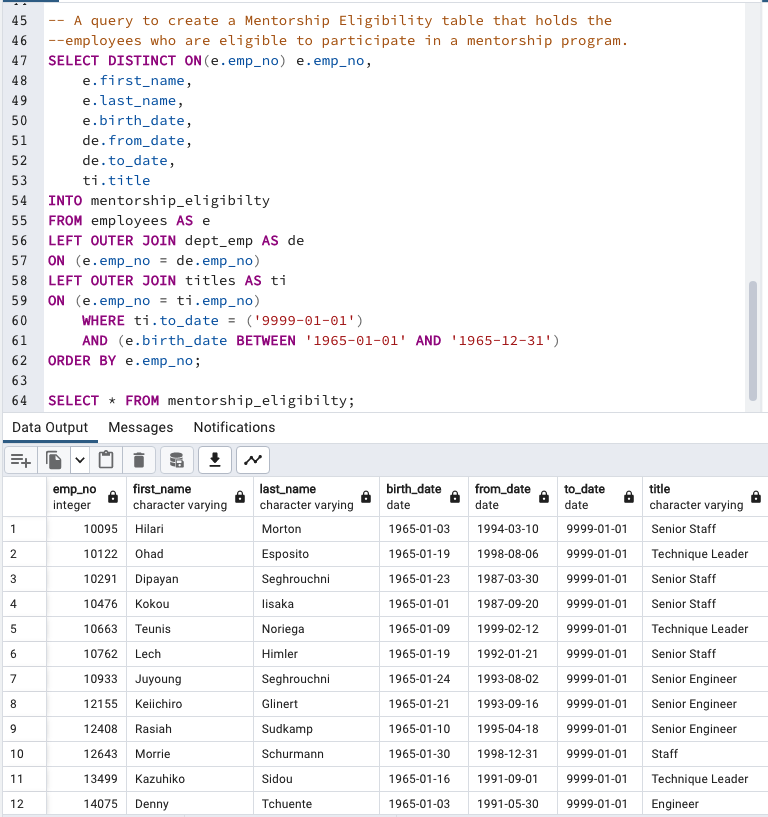

# Pewlett-Hackard-Analysis

## Overview

### Resources

- Software: pgAdmin4(version 6.15)
- Starting Data
    - Departments [Data/Starting_Data/departments.csv](Data/Starting_Data/departments.csv)
    - Department Employees [Data/Starting_Data/dept_emp.csv](Data/Starting_Data/dept_emp.csv)
    - Department Managers [Data/Starting_Data/dept_manager.csv](Data/Starting_Data/dept_manager.csv)
    - Employees [Data/Starting_Data/employees.csv](Data/Starting_Data/employees.csv)
    - Salaries [Data/Starting_Data/salaries.csv](Data/Starting_Data/salaries.csv)
    - Titles [Data/Starting_Data/titles.csv](Data/Starting_Data/titles.csv)

## Results

### Generated Code 

- SQL Code Link [Queries/Employee_Database_challenge.sql](Queries/Employee_Database_challenge.sql)

### Summary of Findings 

## Visualizations

### Employee Data Base Mockup  
- [Images/EmployeeDB.png](Images/EmployeeDB.png)

### CSV Link, Previews, and Code Images 

#### Retirement Titles
- CSV: [Data/Deliverable_Data/retirement_titles.csv](Data/Deliverable_Data/retirement_titles.csv)
- Image [Images/retirement_titles.png](Images/retirement_titles.png)

#### Unique Titles 
- CSV: [Data/Deliverable_Data/unique_titles.csv](Data/Deliverable_Data/unique_titles.csv)
- Image [Images/unique_titles.png](Images/unique_titles.png)

#### Retiring Titles 
- CSV: [Data/Deliverable_Data/retiring_titles.csv](Data/Deliverable_Data/retiring_titles.csv)
- Image [Images/retiring_titles.png](Images/retiring_titles.png)

#### Mentorship Eligibility  
- CSV: [Data/Deliverable_Data/mentorship_eligibilty.csv](Data/Deliverable_Data/mentorship_eligibilty.csv)
- Image [Images/mentorship_eligibilty.png](Images/mentorship_eligibilty.png)

