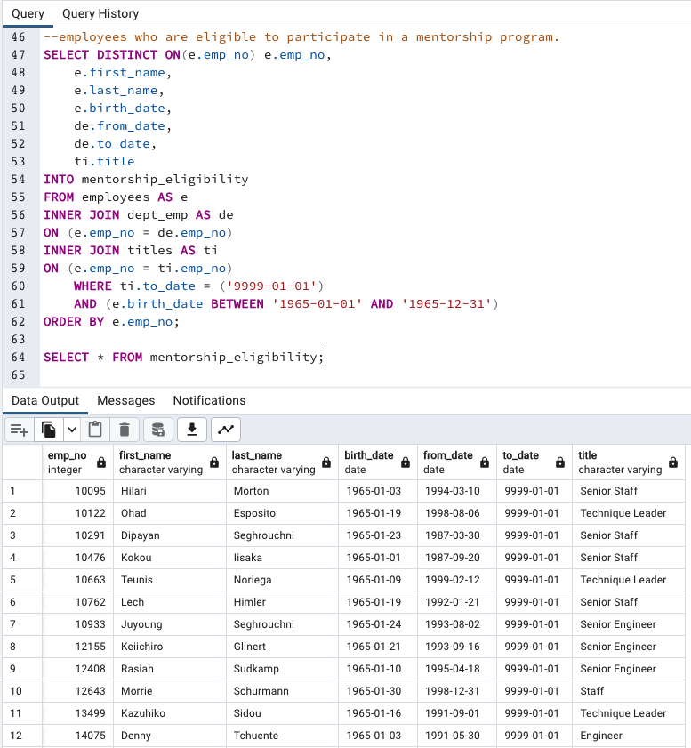

# Pewlett-Hackard-Analysis

## Overview

In this analysis we are helping Pewlett Hackard, a large company with several thousand employees. Many are approaching retirement age and the company needs to be ready to fill the vacancies left behind in their wake. The main questions we will be looking at are, who will be retiring in the next few years, and how many positions will Pewlett Hackard need to fill? We will also look to see who and how many folks may be able to mentor new hires. We will build a data base using SQL with 6 CSV’s of varying lengths and then use them to filter, join and manipulate the data in order to find the information we seek.

### Resources

- Software: pgAdmin4(version 6.15)
- Starting Data
    - Departments [Data/Starting_Data/departments.csv](Data/Starting_Data/departments.csv)
    - Department Employees [Data/Starting_Data/dept_emp.csv](Data/Starting_Data/dept_emp.csv)
    - Department Managers [Data/Starting_Data/dept_manager.csv](Data/Starting_Data/dept_manager.csv)
    - Employees [Data/Starting_Data/employees.csv](Data/Starting_Data/employees.csv)
    - Salaries [Data/Starting_Data/salaries.csv](Data/Starting_Data/salaries.csv)
    - Titles [Data/Starting_Data/titles.csv](Data/Starting_Data/titles.csv)

# Results

## Generated Code 

- SQL Code Link [Queries/Employee_Database_challenge.sql](Queries/Employee_Database_challenge.sql)

## Major Points from Analysis

1.	Retirement Titles: In this data query we show that 133,776 titles have been held over the years by folks that are retirement age. 
2.	Unique Titles: This list provides us with 72,458 retirement age current employees with their most recent job titles. 
3.	Retiring Titles: A list of how many of each title will be retiring. It shows that; 25,916 Senior Engineers; 24,926 Senior Staff; 9,285 Engineers; 7,636 Staff; 3,603 Technique Leaders; 1,090 Assistant Engineers; and 2 Managers. 
4.	Mentorship Eligibility: Here we show that there are 1,549 current employees that could help with a mentorship program with new hires. 

## Summary of Findings 

In helping Pewlett Hackard I analyzed the starting data and saw that there are 300,024 employees in the data base created from the six initial CSV’s. When filtering out for retirement age and those who are still current employees, there are 72,458 people who are going to potentialy soon retire. That means there will be 25,916 Senior Engineers, 24,926 Senior Staff, 9,285 Engineers, 7,636 Staff, 3,603 Technique Leaders, 1,090 Assistant Engineers and two Manager positions that are going to be needed to be filled. 

With 24 people managing nine departments we know that that means there are only 2-4 managers per department, and as mentioned above, two among the 24 are retiring. These folks will certainly have their work cut out for them during this transition. Luckily, we have assisted in investigating a possible solution that could be helpful. What we see from looking closer at the data is that there are 1,549 employees that were born in 1965 that could potentially help with a mentorship program with new hires. This is not enough mentors for all the new folks that will need to be hired, but it’s a great start.

There are a few things we could further look into in order to further helpful make a clearer picture of this data. One, is to group the eligible mentors by title an/or department, this will help Pewlett Hackard understand where these resources are distributed. The other idea they could think about would be to do a buddy system with current employees that have not been there long. This way new hires have someone to show them the ways of the company from a source that is more at their same level. In order to get a list of current employees that could help with this, you’d have to join the employee table and the department-employee table, then filter by employee hire date and department-employee to date and perhaps group by department number. 

In conclusion Pewlett Hackard has its work cut out for them over the next few years as they make this transition an hire and train so many people.  

## Visualizations

### Employee Data Base Diagram  
- [Images/EmployeeDB.png](Images/EmployeeDB.png)

## CSV Link, Code Images, & Previews

### Retirement Titles
- CSV: [Data/Deliverable_Data/retirement_titles.csv](Data/Deliverable_Data/retirement_titles.csv)
- Image [Images/retirement_titles.png](Images/retirement_titles.png) 

### Unique Titles
- CSV: [Data/Deliverable_Data/unique_titles.csv](Data/Deliverable_Data/unique_titles.csv)
- Image [Images/unique_titles.png](Images/unique_titles.png)

### Retiring Titles Count
- CSV: [Data/Deliverable_Data/retiring_titles.csv](Data/Deliverable_Data/retiring_titles.csv) 
- Image [Images/retiring_titles.png](Images/retiring_titles.png)

### Mentorship Eligibility  
- CSV: [Data/Deliverable_Data/mentorship_eligibility.csv](Data/Deliverable_Data/mentorship_eligibility.csv)
- Image [Images/mentorship_eligibility.png](Images/mentorship_eligibility.png)

